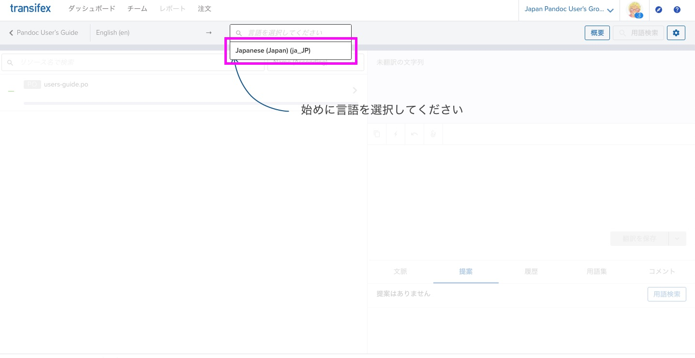
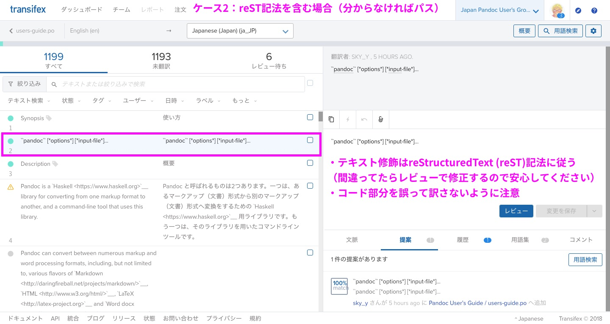

===========================================================
翻訳の手引 for Pandocユーザーズガイド
===========================================================

※ 順次書いていきます。

Pandocユーザーズガイドの翻訳作業に参加される方向けに説明します。

前提
=====

- **reStructuredText (reST)** という、Markdownよりも高機能な記法を使います

   - 詳しくは `早わかり reStructuredText <https://quick-restructuredtext.readthedocs.io/en/latest/>`_ を参考にしてください
   - なぜ？→ `Sphinx <http://sphinx-users.jp/>`_ というドキュメントビルダーの機能をフルに使いたいので（特に翻訳関係）

- 実際には **Transifex** というWebアプリを使って、翻訳作業を進めていただきます

参加方法
=========

`Pandocユーザーズガイド日本語版 翻訳ボランティア 登録フォーム <https://docs.google.com/forms/d/e/1FAIpQLScOdbrRWXKWAOHop7yyxrmq-D8DcwHo6u8aNAywRgfd3pX6dQ/viewform>`_ よりご参加ください。

管理者（藤原）が下記に登録します。

- Transifex（翻訳用のWebアプリ）

   - 初めての方は、招待後に送られるリンクから、Transifexのアカウントを作成してください

- Pandocユーザ会 Slack

作業手順
==============

Transifexのトップ（「翻訳」を選ぶ）
--------------------------------------

.. image:: img/transifex-top.jpg

Transifexの開始時（言語を選ぶ）
---------------------------------

ケース1: 普通に翻訳する場合
---------------------------------

.. image:: img/transifex-main1.jpg

1. 左側：訳したい文字列を選択（自分が訳せそうなもののみでOKです）
2. 右上：原文（英語）の文字列が出ているのを確認
3. 右下：訳文（日本語）の文字列を入力
4. 「変更を保存」をクリック（自信がない場合は「提案として保存」でもOK）
5. 1に戻る。 **適当なところで切り上げる** （キリがないので）

※ 最終的に責任者（藤原）がレビューします

- 原文の `Pandoc User’s Guide <https://pandoc.org/MANUAL.html>`_ もあわせて確認してください

   - 文脈がよくわからなくなるので（余裕があれば、Transifexの「文脈」にメモを残してくれると嬉しいです）

- よくわからないテキストは放置してください。
- 訳したいけどわからない場合は、Slack ``#users-guide-trans`` で質問してください。

ケース2: reST記法を含む場合
---------------------------------

- reST記法を含む場合は、 **元のreST記法（特にリンク）を崩さないようにしてください**

   - リンク（\`リンク文字列 <URL>\`_ など、いくつか種類がある）
   - コード（バッククォート2つで囲む）
   - 見出し（見出しの次の行に ``=`` または ``-`` をたくさん並べる。Transifexの文字列には現れないので注意）
   - 太字、リストは大体同じ（ただしリストの入れ子は空行必須）
   - 詳しくは: `早わかり reStructuredText <https://quick-restructuredtext.readthedocs.io/en/latest/>`_ 
   - その他、よくわからない記号は基本的にいじらないようにしてください（レビューで修正します）

お礼について
==============

**金銭的なお礼はありません。** あらかじめご了承ください。

翻訳・レビューにおいて貢献実績が確認された方には、お名前・Twitter ID・リンクなど（あれば）をサイトに掲載するようにします。
（掲載時にお伺いします。「掲載しない」でも可能です）
