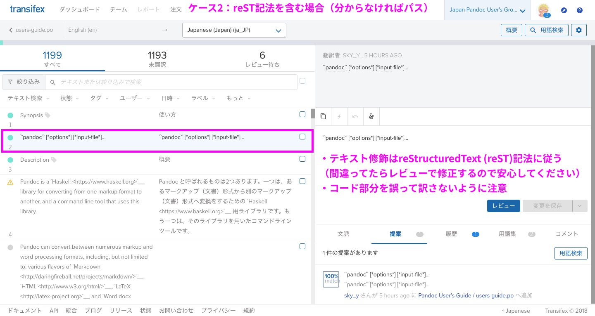

===========================================================
翻訳の手引 for Pandocユーザーズガイド
===========================================================

※ 順次書いていきます。

Pandocユーザーズガイドの翻訳作業に参加される方向けに説明します。

サイトまとめ
==========

- Slack

   - Pandocユーザ会のSlackで、連絡などを行っています
   - 招待リンク: https://join.slack.com/t/jpang/shared_invite/enQtNjE1MTgzOTkxMjgyLWEzNGVhMmZhODE4ZTVjNDhiYmU1OGNkYzJlZjMwM2NlNmNlNzJmOGY4YzFmYjQ1MTVlNjJiNzk1MzI3ODdmNmY

- GitHub

   - `jgm/pandocのMANUAL.txt <https://github.com/jgm/pandoc/blob/master/MANUAL.txt>`_
   - `pandoc-jp/pandoc-doc-ja: 日本語訳のSphinxサイト <https://github.com/pandoc-jp/pandoc-doc-ja>`_

- Transifex（クラウド上で共同翻訳するためのWebアプリ）

   - `Transifex: Pandoc User’s Guide プロジェクト <https://www.transifex.com/jpang/pandoc-users-guide/dashboard/>`__
   - 参加希望者は招待します。「参加方法」を参照。

- Read the Docs（翻訳後のドキュメントをデプロイする先）

   - `（新装工事中）日本Pandocユーザ会 — 日本Pandocユーザ会 2019.02.21 ドキュメント <https://pandoc-doc-ja.readthedocs.io/ja/latest/index.html>`__
   - いまお読みのドキュメントが、Read the Docsにデプロイされています
   - デプロイは藤原が行います

前提
=====

- **reStructuredText (reST)** という、Markdownよりも高機能な記法を使います

   - 詳しくは `早わかり reStructuredText <https://quick-restructuredtext.readthedocs.io/en/latest/>`_ を参考にしてください
   - なぜ？→ `Sphinx <http://sphinx-users.jp/>`_ というドキュメントビルダーの機能をフルに使いたいので（特に翻訳関係）

- 実際には **Transifex** というWebアプリを使って、翻訳作業を進めていただきます

参加方法
=========

`Pandocユーザーズガイド日本語版 翻訳ボランティア 登録フォーム <https://docs.google.com/forms/d/e/1FAIpQLScOdbrRWXKWAOHop7yyxrmq-D8DcwHo6u8aNAywRgfd3pX6dQ/viewform>`_ よりご参加ください。

管理者（藤原）が下記に登録します。

- Transifex（翻訳用のWebアプリ）

   - 初めての方は、招待後に送られるリンクから、Transifexのアカウントを作成してください

- Pandocユーザ会 Slack

作業手順
==============

Transifexのトップ（「翻訳」を選ぶ）
--------------------------------------

.. image:: img/transifex-top.jpg

- Transifexの開始時に言語を選ぶ画面が出てきた場合は ``Japanese (ja)`` を選択してください。

   - ``Japanese (Japan) (ja_JP)`` は使用せず、 ``Japanese (ja)`` に統一しました。

ケース1: 普通に翻訳する場合
---------------------------------

.. image:: img/transifex-main1.jpg

1. 左側：訳したい文字列を選択（自分が訳せそうなもののみでOKです）
2. 右上：原文（英語）の文字列が出ているのを確認
3. 右下：訳文（日本語）の文字列を入力
4. 「変更を保存」をクリック（自信がない場合は「提案として保存」でもOK）
5. 1に戻る。 **適当なところで切り上げる** （キリがないので）

※ 最終的に責任者（藤原）がレビューします

- 原文の `Pandoc User’s Guide <https://pandoc.org/MANUAL.html>`_ もあわせて確認してください

   - 文脈がよくわからなくなるので（余裕があれば、Transifexの「文脈」にメモを残してくれると嬉しいです）

- よくわからないテキストは放置してください。
- 訳したいけどわからない場合は、Slack ``#users-guide-trans`` で質問してください。

ケース2: reST記法を含む場合
---------------------------------

- reST記法を含む場合は、 **元のreST記法（特にリンク）を崩さないようにしてください**

   - リンク（\`リンク文字列 <URL>\`_ など、いくつか種類がある）
   - コード（バッククォート2つで囲む）
   - 太字、リストは大体同じ（ただしリストの入れ子は空行必須）
   - 詳しくは: `早わかり reStructuredText <https://quick-restructuredtext.readthedocs.io/en/latest/>`_ 
   - その他、よくわからない記号は基本的にいじらないようにしてください（レビューで修正します）

- **reST記法の前後には、半角スペースを入れてください。**

悪い例::

   `Word docx`_など、

よい例 (「など」の手前に半角スペース)::

   `Word docx`_ など、

また、reSTの見出し（見出しの次の行に ``=`` または ``-`` をたくさん並べる）は **Transifexの文字列には現れない** ので注意してください。

(原文のreST版 `users-guide.rst <https://github.com/pandoc-jp/pandoc-doc-ja/blob/master/users-guide.rst>`_ を見ると、見出しの様子がわかります)

ケース3: (reST記法) 内部ハイパーリンクターゲット
----------------------------------

PandocでMarkdown → reSTに変換する際、現在は ``--reference-links`` というオプションを付けています。
これにより、リンクは原則として \`foo\`\_ という形式（参照リンク・内部リンク）として現れます。

この場合、テキスト (``foo``) もそのままにしてください！

例::

   `Templates`_  → `Templates`_
   (`テンプレート`_ に翻訳しない)

ただし、リンクの参照元がTransifexに表示されないので（原因調査中）、翻訳の際は下記の原文も参照してください。
(レビュー時にまとめて修正します)

- 原文 Markdown版: `jgm/pandoc: MANUAL.txt <https://github.com/jgm/pandoc/blob/master/MANUAL.txt>`_
- 原文 reST版: `pandoc-jp/pandoc-doc-ja: users-guide.rst <https://github.com/pandoc-jp/pandoc-doc-ja/blob/master/users-guide.rst>`_

お礼について
==============

**金銭的なお礼はありません。** あらかじめご了承ください。

翻訳・レビューにおいて貢献実績が確認された方には、お名前・Twitter ID・リンクなど（あれば）をサイトに掲載するようにします。
（掲載時にお伺いします。「掲載しない」でも可能です）

補足: 2019-04-27時点で、藤原のミスでTransifex上の翻訳者名が消失してしまっています。申し訳ありません。
以下の方々に関しては、翻訳による貢献を確認しているので、成果物にはお名前を含める予定です。

- makotosanさん
- niszetさん
- べこさん (becolomochi)

Q&A
=====

- Q: Issueを見つけた。どうしたらいい？

   - `Issues · pandoc-jp/pandoc-doc-ja <https://github.com/pandoc-jp/pandoc-doc-ja/issues>`_ にまとめています。
     必要であれば、Issueを追加してください。また、過去のIssueも少しあるので参考にしてください。

     もしくは、Slack ``#users-guide-trans`` に直接質問ください。

参考
====

ビルド・デプロイに使用しているツールまとめ
-----------------------------------

- Pandoc

   - 変換: MANUAL.txt(markdown) -> users-guide.rst(reStructuredText)

- Sphinx

   - rstからHTML（サイト）を構築
   - 国際化(sphinx-intl)

- Transifex

   - 実際にテキストを翻訳（共同）

- Read the Docs

   - GitHub上のSphinxサイトをビルドして公開

機械翻訳について
-------------

機械翻訳は **各自の責任において、参考・補助のために** 利用可能とします。ただし、各自で最終的には **Transifex上に訳文を反映させてください** 。
(訳文のマスターデータ[.poファイル]は、Transifexにあるものとします)

- Ubuntuコミュニティでこういう事件もあったために、「レビューは人力でやる ＆ 藤原が最終責任を持つ」という体制は崩さないようにしようと思います。

   - `Ubuntu英日翻訳にGoogle翻訳の成果物を突っ込む人物が現れライセンスがなんじゃもんじゃでつらい - Togetter
<https://togetter.com/li/1084225>`_

- 目安（グレーゾーン判定は藤原がやります）

   - OK「翻訳者の責任で、翻訳テキストを書く」
   - グレーゾーン「Google翻訳を「参考」として利用する」（程度問題）
   - グレーゾーン「Google翻訳が出したテキストを、一部利用する」（程度問題）
   - NG「Google翻訳の「結果」を、100%そのまま利用する」

ツールの参考: `Google翻訳者ツールキット <https://translate.google.com/toolkit/>`_ (by makotosan さん)

> Transifexは原文のエレメント単位で翻訳する仕様なので、長文のブロックが非常に翻訳しづらくなります。
> 翻訳者ツールキットは、原文を分割することができるので、
> 
> 1. TransifexからPOをダウンロードして翻訳者ツールキットで読み込み
> 2. 翻訳者ツールキット上で原文を分割=>機械翻訳もしくは@sky_y さんの旧バージョンのユーザーガイドからテキスト拝借
> 3. 訳文をリライト
> 4. エレメント単位の翻訳完了後、翻訳者ツールキットからTransifexにコピペ
> 
> で長文を乗り切ることができました。
> 良ければ試してみてください。

textlintについて
------------

日本語を自動的に校正してくれるツール `textlint <https://textlint.github.io/>`_ については、
現状のプロジェクトとしては導入していませんが、現状各自で利用してかまいません。

- Transifexやpoファイルとの兼ね合いがうまくいかないので……。
- レビュー時に一度適用してみようと思います。

ルールを利用する際は `textlint-rule-preset-ja-technical-writing <https://github.com/textlint-ja/textlint-rule-preset-ja-technical-writing>`_ というプリセットを利用してください。
